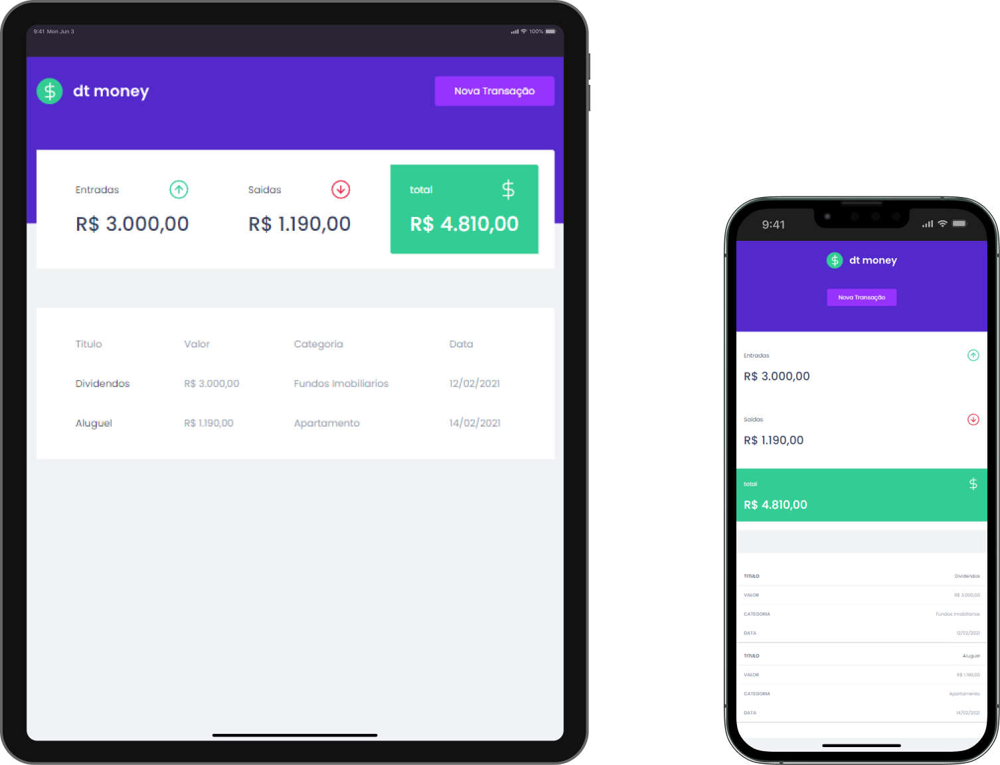

<h1>
🚀 Project status: Concluded  :white_check_mark:
</h1>

Link Deploy Project - https://bruno-santos-dtmoney.netlify.app/

  

<h1>DT Money</h1>

dt-money is a simple application for financial control, developed during Rocketseat's Ignite

<h1> Prerequisites and how to run the application</h1>

Before starting, you will need to have the following tools installed on your machine: Git, Node.js and NPM. Besides, it's good to have an editor to work with the code like VSCode

<h1>Running the Back End (server)</h1>

<h3>1- Clone this repository</h3>

$ git clone

<h3>2- Access the project folder in the terminal/cmd</h3>

$ cd DT-Money

<h3>3- Install the dependencies</h3>

$ npm install

  
<h3>4- Run the application in development mode</h3>

$ npm start

  
<h3>5- The server will start at porta:3000 - access
Success!! 😬</h3>
  
<h1>🛠 Technologies used</h1>
The following tools were used in building the project:

- Node.js
- NPM
- React
- Styled Components
- John Adams
- TypeScript
